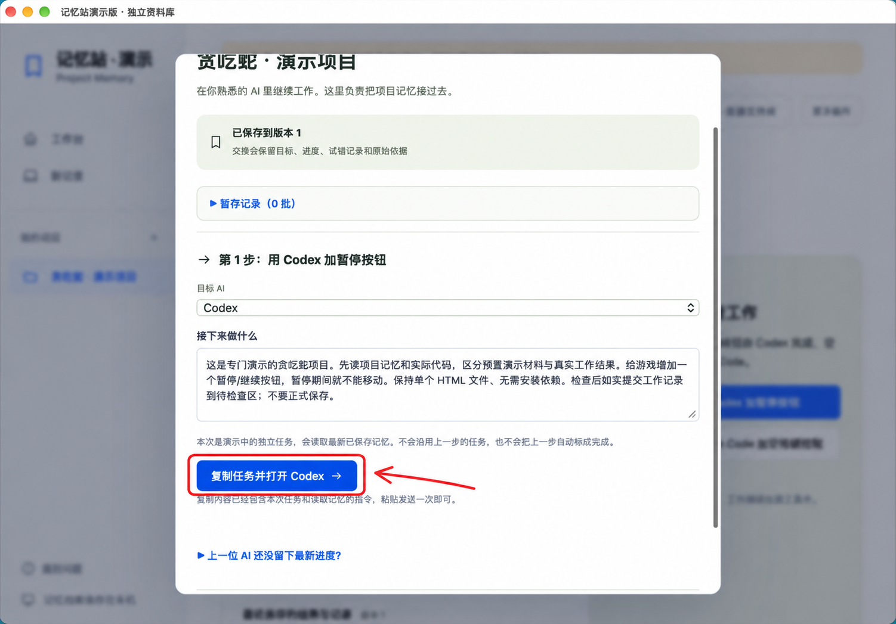
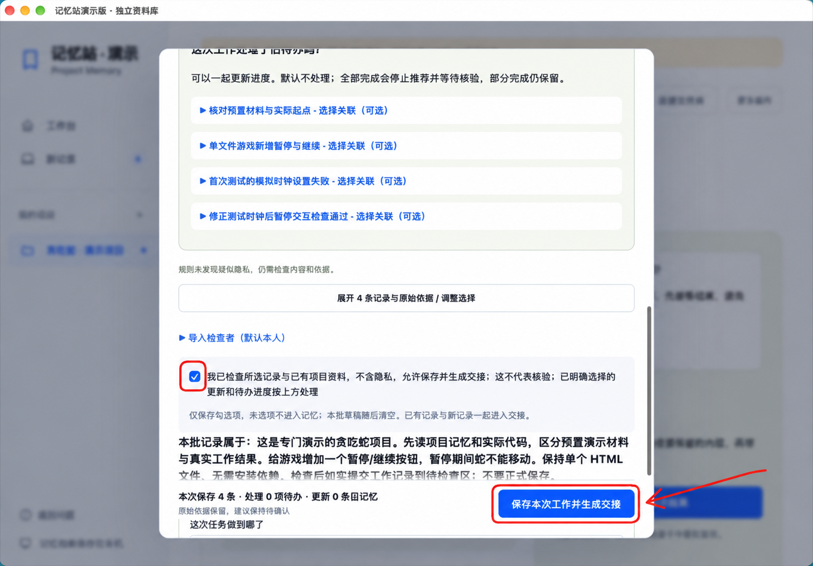
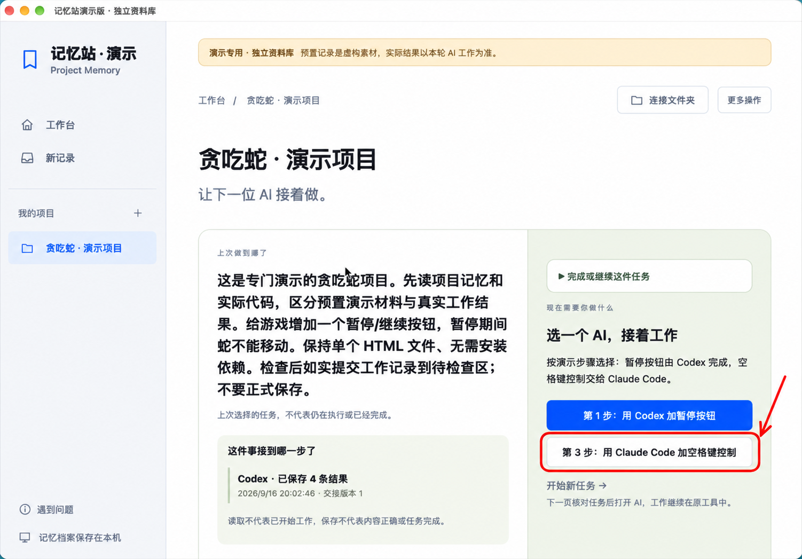
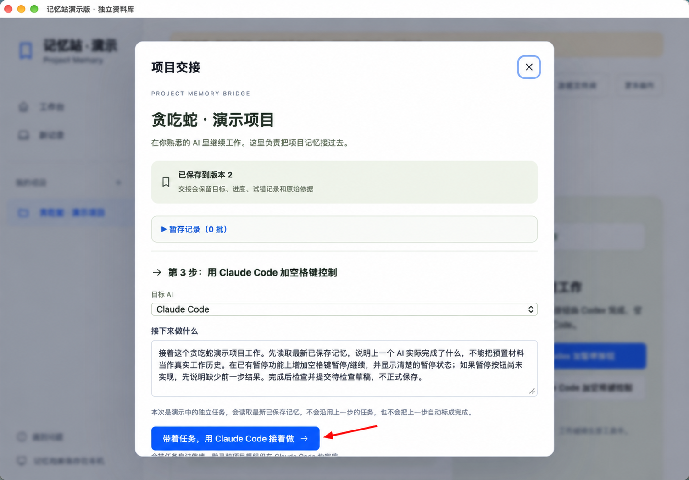
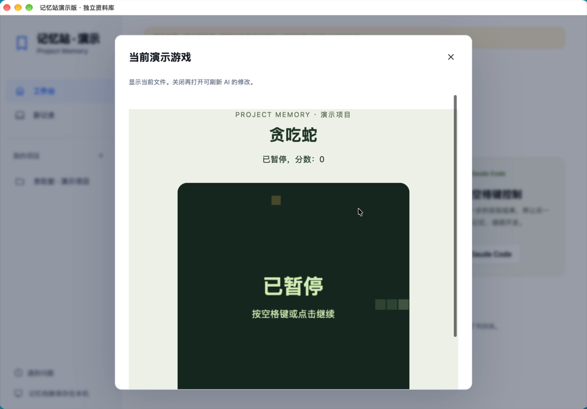

# 第一次用记忆站，看这一篇就够了

假设你正在用 Codex 做一个小游戏，做到一半，想换 Claude Code 接着做。过去你可能要让 Codex 写一份日志，再复制给 Claude，还要解释“做到哪里了、什么办法已经试过”。

记忆站就是帮你管理这份交接记录的。**你仍然在 Codex 或 Claude Code 里工作；记忆站负责把检查过的项目记录交给下一位 AI。**

## 看图上手：从 Codex 换到 Claude Code

**先让 Codex 加暂停按钮，再让 Claude Code 增加空格键控制。** 红色画笔标出要操作的位置，点击图片可以放大查看。

下面取自独立演示项目；「第 1 步／第 3 步」是专门演示界面的按钮，当前下载版的按钮可能略有不同。先看懂流程，再按下文安装并连接你自己的项目。

### ① 写清任务，交给 Codex

核对任务，点 **复制任务并打开 Codex**。进入 Codex 后，**粘贴到新任务并发送一次**；只打开窗口不会自动开工。之后在 Codex 里继续做事。

### ② AI 做完后，检查记录再保存

回记忆站点「查看新记录」，展开核对内容和原始依据。不对的先改或取消选择，检查隐私后再勾选确认，点 **保存本次工作并生成交接**。保存不等于验证了 AI 说的每句话。

### ③ 换 Claude Code，明确下一步要做什么

暂停按钮已经完成后，在同一个项目里点 **第 3 步：用 Claude Code 加空格键控制**。这是让它继续做新功能，不是重复上一轮任务。日常使用时，选择另一位 AI，并写清接下来要做的事。

### ④ 核对任务，打开 Claude Code 接着做

确认「接下来做什么」是新任务，再点 **带着任务，用 Claude Code 接着做**。随后在打开的终端里继续工作；登录和项目授权按 Claude Code 的提示处理。

做完后，回记忆站重复第 ② 步：检查这次的新记录，再保存。**工作在 AI 工具里完成，记忆站负责接续和保存检查过的记录。**

查看这次游戏结果与完整演示视频（可选）

这次接续后，游戏已有暂停按钮和空格键控制。以下是录屏中的暂停画面；单次演示不代表所有场景均已验证。

[下载完整演示视频：1 分 45 秒，MP4，约 9.8 MB](https://github.com/WoYun520/project-memory/raw/refs/heads/main/docs/media/codex-to-claude-demo.mp4)。下载后用本机播放器打开。

视频为无声实录，配有步骤字幕；等待已删减，部分画面加速。中途曾发生记录投递失败，修正与重新投递过程未录入原片，视频以字幕说明。预置素材为演示内容。

## 先准备好

- 一台 Apple 芯片的 Mac，系统为 macOS 13 或更新版本。苹果菜单 → 关于本机，可以查看。
- 已安装并能正常使用的 Codex 或 Claude Code。先连接其中一个即可，以后再换另一个。
- 一个正在做的项目，例如小游戏、网页或工具的文件夹。

这里的 Claude Code 是终端里的开发工具，不是普通 Claude 网页聊天。记忆站不包含 AI 账号或模型额度。

## 安装记忆站

打开 [下载页面](https://github.com/WoYun520/project-memory/releases/tag/v0.39.0-preview)，在 **Assets（附件）** 中下载 `Memory-Station-0.39.0-mac-arm64.zip`，解压，把 `记忆站.app` 放进应用程序文件夹，再打开。

不要把 GitHub 的绿色 Code 按钮下的 “Download ZIP” 当成 Mac 安装包；那一份是给开发者看的源码。如果 Releases 还没有应用附件，请等维护者提供，或按仓库首页的源码方法运行。

**这还是早期预览版。** 应用尚未完成 Apple 公证，其他电脑可能提示无法验证或阻止打开。不要为了试用关闭系统保护；遇到这种情况先停止，把不含个人资料的提示文字反馈给维护者。当前没有保证“一定能在每台 Mac 上安装”。

## 第一次连接：选文件夹，选 AI，点连接

打开后，点 **连接第一个项目**。

点 **选择项目文件夹**，选择你正在做的那个项目。比如做贪吃蛇，就选放着贪吃蛇文件的文件夹，不要选整个“文稿”或整块硬盘。

记不住文件夹在哪里？展开 **找不到文件夹？让当前 AI 帮忙**，复制里面的说明，发给正在帮你做这个项目的 AI。位置送回来后，核对一下再连接。

然后选择 **Codex** 或 **Claude Code**，点 **连接并启用接续**。记忆站会在这个项目里添加几份交接指引，原来的项目规则会保留。如果文件冲突，它会停下来提示，不会直接覆盖。

Mac 如果询问是否允许访问文件，请根据你选择的项目允许访问。不需要为了使用记忆站开启完整磁盘访问。

## 继续去原来的 AI 里做事

连接完成后，“接下来做什么”里写一句具体任务就好，例如：

> 给计时器加一个暂停按钮，保留原来的开始和重置功能。

**用 Codex：** 点击复制并打开后，把复制的内容粘贴到 Codex 的新任务中，发送一次。只打开窗口，AI 还不会自动收到你的任务。

**用 Claude Code：** 点击后会尝试在终端里带着任务启动。需要登录或允许访问项目时，在 Claude Code 里按提示处理。

之后就在那个 AI 里继续提要求、看结果、改东西，不需要每句话都回记忆站输入。

第一次连接时没有历史记忆是正常的。记忆站不会自动读你过去所有聊天。如果旧 AI 还知道之前的情况，可以让它按交接说明整理目标、进度和真实试错记录；不知道的内容就写未知。

## 做完了，检查一次再保存

AI 把工作记录送回来后，记忆站会出现 **新记录** 提示。

点 **查看新记录**，看一眼它写的内容：做了什么、还差什么、有没有把建议写成已完成。可以展开看原文，不对的内容先修改或取消选择，再保存。

- 只是想留下记录：保持默认的“只保存记录”。
- 还有没做完的：选“还有没做完的”，写一句剩余事项。
- 你认为这件任务已经完成：明确选择完成，任务会进入历史。

保存表示你把它收入项目档案，不等于你验证了 AI 说的每一句话。不要把没做过的测试写成通过。

## 下次换 AI，就从同一个项目接着做

回到这个项目，选另一位 AI，再选 **接着做**。下一位 AI 会通过交接读取最新保存的记忆，你继续在它自己的工具里工作。

看到“已请求打开”只是打开请求；看到读取回执，表示读取工具已取到交接内容。它是否理解准确，还要看它接下来的回答和实际工作。

可以先问它：

> 先不要改文件。说说这个项目要做什么、做到哪里、还有哪些没做完，以及哪些要求不能随便改变。没有记录的就说不知道。

如果发现遗漏，回到来源补充并检查保存，再让它读取最新版本。不要让它猜一份历史补上。

## 遇到问题先看这里

**找不到 AI：** 先确认原 AI 已安装、能独立打开并登录，再点重新检查。记忆站不会代你登录。

**AI 没送回记录：** 使用页面里的收尾说明，发给刚才工作的 AI，让它整理本次实际结果。没有新记录不等于原记录丢了。

**提示有待检查记录或版本变了：** 先处理新记录，再生成新的交接。还没保存的草稿不会交给下一位 AI。

**Mac 一直等权限：** 处理系统访问提示后等它连接；如果先前拒绝了，可在应用菜单中重新选择原记忆文件夹授权，不要为了启动删除资料库。

**AI 提示账号、额度或组织不可用：** 需要在对应 AI 服务处理，记忆站不能解决账号权限问题。

## 记住两件事

**不要往里放密码、密钥或私人原件。** 产品有规则检查，但不能保证识别所有隐私。反馈问题时也不要上传真实记忆库、完整交接或账号截图。

**记忆保存在本机，但外部 AI 不一定离线。** 你交给 Codex 或 Claude Code 的资料，可能按它们的规则发送到模型服务。

想先练习，可以使用仓库里的 [虚构计时器项目](../examples/timer/README.md)。更详细的连接和备份说明见 [快速开始与故障处理](quick-start.md)。
